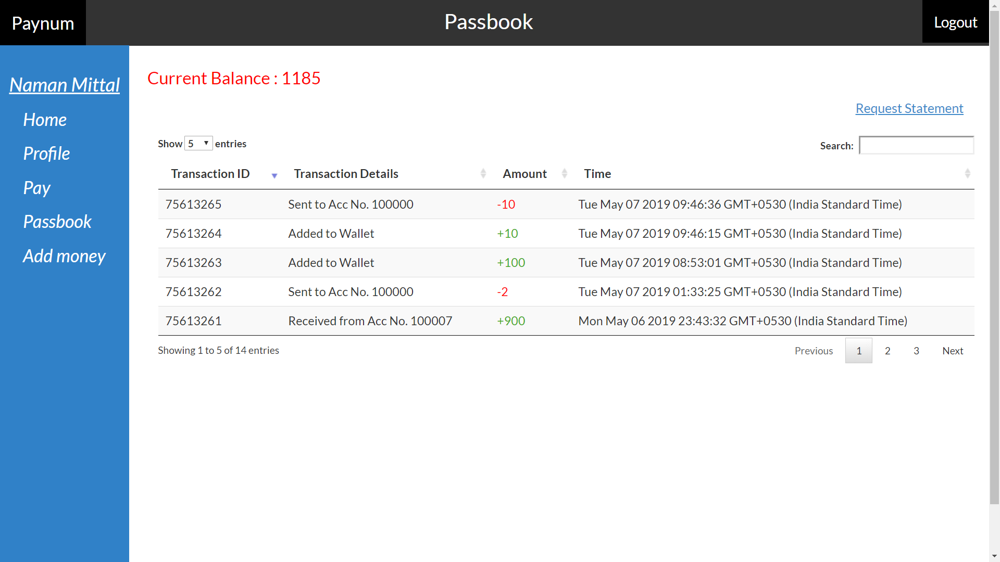

# PayNum
Online Wallet

A Website with all new and advanced features to manage the details of Account, Transactions, Statement and Feedback.
Similar to paytm

To run the project follow the steps below :

* Clone/Download the project
* Import database from paynum.sql in your database
* Enter your database details in the config.js file
* In register-controller file and index.js, write your e-mail id and password for sending mails
* Run the command "node index.js" in command prompt in your project directory
* If error of uninstalled module, install he module using the command "npm install -g module_name"
* Your project is ready, Run it as "localhost:3000" on your device or "IP_yourDevice:3000" on other device connected through same WLAN as yours

